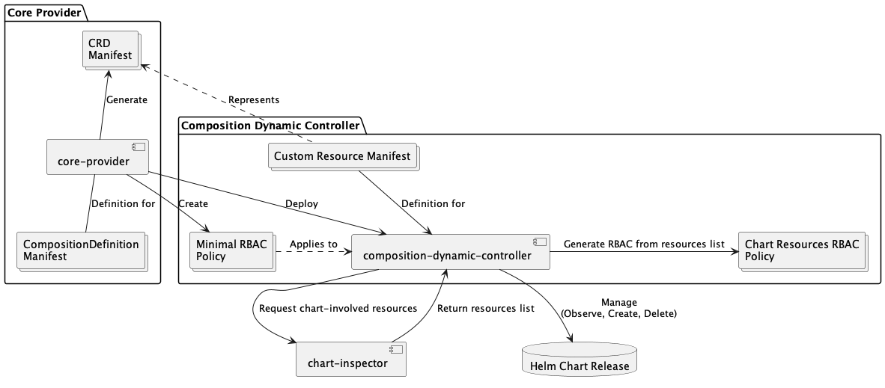
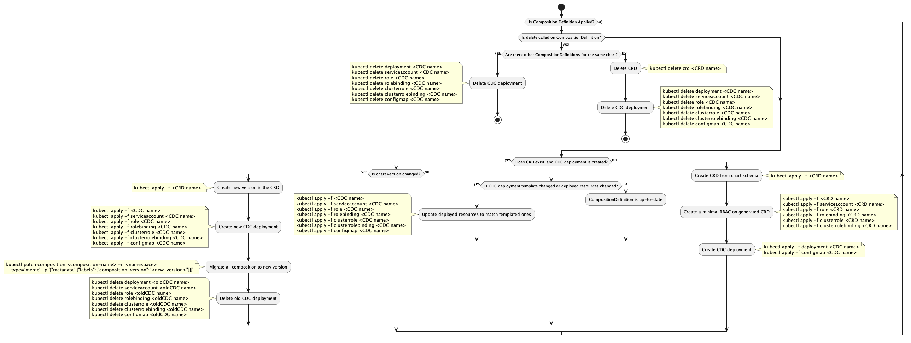

# Krateo Core Provider

The Krateo Core Provider is the foundational component of Krateo Composable Operations (KCO), enabling the management of Helm charts as Kubernetes-native resources. It provides:

- Schema validation through JSON Schema
- Automated CRD generation
- Versioned composition management
- Secure authentication mechanisms

## Summary

- [Krateo Core Provider](#krateo-core-provider)
  - [Summary](#summary)
  - [Architecture](#architecture)
  - [Workflow](#workflow)
  - [Requirements](#requirements)
  - [Overview](#overview)
    - [Authentication](#authentication)
    - [RBAC Generation](#rbac-generation)
    - [Composition Definition](#composition-definition)
  - [Requirements](#requirements-1)
  - [Examples](#examples)
    - [How to Install](#how-to-install)
    - [Apply the CompositionDefinition Manifest](#apply-the-compositiondefinition-manifest)
    - [Upgrade Chart Version](#upgrade-chart-version)
      - [Update the Fireworksapp Chart in the `CompositionDefinition`](#update-the-fireworksapp-chart-in-the-compositiondefinition)
      - [Automatic Deletion of Unused `composition-dynamic-controller` Deployments](#automatic-deletion-of-unused-composition-dynamic-controller-deployments)
    - [Multi-Version Management](#multi-version-management)
  - [Authentication](#authentication-1)
    - [OCI Registry](#oci-registry)
      - [GCP Artifact Registry](#gcp-artifact-registry)
    - [Helm Repository](#helm-repository)
  - [CRD Configuration](#configuration)
  - [Environment Variables and Flags](#environment-variables-and-flags)
  - [Security Features](#security-features)
  - [Best Practices](#best-practices)


## Architecture



This diagram outlines the high-level architecture and interactions within the Core Provider, responsible for managing CompositionDefinitions and related resources. It illustrates the relationships between key components such as the Core Provider itself, the Composition Dynamic Controller (CDC), the Chart Inspector, and various Kubernetes resources.

The Core Provider generates CRDs, creates RBAC policies, and deploys the CDC. The CDC manages Helm chart releases, requests resource information from the Chart Inspector, and generates RBAC policies based on those resources. The diagram highlights the flow of definitions and resources between these components, showcasing how the Core Provider orchestrates the deployment and management of composed applications within a Kubernetes cluster.


## Workflow



This diagram illustrates the Core Provider's workflow for managing CompositionDefinitions, which define how resources are composed and managed in a Kubernetes environment. It encompasses the lifecycle of Helm releases and associated resources, involving the creation and updating of CRDs (Custom Resource Definitions), RBAC (Role-Based Access Control), and CDC (Composition Dynamic Controller) deployments. These actions are conditional, based on chart versions and the current state of the cluster.

**Note:** The `kubectl` commands within the notes serve as illustrative examples of the operations performed by the Core Provider and are not intended for direct user execution. They provide insights into the resource management processes undertaken by the system.

## Requirements

From version 0.23.0, the core-provider requires version 0.4.3 or higher of snowplow to support the retrieval of plurals from the cluster. See the URL_PLURALS variable in [Environment Variables and Flags](#url_plurals) for configuration information.

## Overview

The `core-provider` is a Kubernetes operator that downloads and manages Helm charts. It checks for the existence of `values.schema.json` and uses it to generate a Custom Resource Definition (CRD) in Kubernetes, accurately representing the possible values that can be expressed for the installation of the chart.

Kubernetes is designed to validate resource inputs before applying them to the cluster, and the `core-provider` provides input validation to ensure that incorrect inputs are not accepted.

### Authentication

The `core-provider` also handles authentication to private OCI registries and Helm repositories. Users can provide their credentials through Kubernetes secrets, and the `core-provider` will use them to download the necessary chart resources.

### RBAC Generation  

Starting from version **0.22.0** of `core-provider`, the RBAC generation process has been updated for the following reasons:  

- **Auto-healing of the RBAC policy for `composition-dynamic-controller`**: The previous RBAC generation strategy made it difficult to automatically update the RBAC policy for `composition-dynamic-controller` when cluster conditions changed (e.g., when CRD installation was required). The new approach enhances resilience by dynamically adjusting RBAC policies as needed.  

- **More reliable retrieval of `apiVersion` and `kind` from templates**: In earlier versions, `core-provider` extracted resource information by parsing raw Helm chart templates. This method was unreliable, as it could result in incomplete RBAC policies due to parsing errors or edge cases (e.g., templated `apiVersion` or `kind`). The updated approach ensures more accurate and comprehensive RBAC generation.  

Starting from version **0.22.0**, RBAC generation is now handled directly by `composition-dynamic-controller` with the help of [`chart-inspector`](https://github.com/krateoplatformops/chart-inspector). As a result, `core-provider` only generates a **base (static) RBAC policy**, granting `composition-dynamic-controller` the necessary permissions to generate its own RBAC dynamically.  

For more details on RBAC generation, refer to:  
- [`chart-inspector` README](https://github.com/krateoplatformops/chart-inspector)  
- [`composition-dynamic-controller` README](https://github.com/krateoplatformops/composition-dynamic-controller/blob/main/README.md)  

### Composition Definition

A Composition is a Helm Chart archive (.tgz) with a JSON Schema for the `values.yaml` file. The JSON Schema file must be named `values.schema.json`.

Here are some online tools to generate and validate JSON Schemas:

- https://jsonformatter.org/yaml-to-jsonschema
- https://codebeautify.org/yaml-to-json-schema-generator
- https://www.jsonschemavalidator.net/
- https://json-schema.hyperjump.io/

## Requirements

In order to work, `core-provider` needs `krateo/snowplow` installed in the `krateo-system` namespace. Refer to [how to install](#how-to-install).

## Examples

You can see a more practical guide on `core-provider` usage at [this link](cheatsheet.md).

### How to Install

The `core-provider` requires [Snowplow](https://github.com/krateoplatformops/snowplow/tree/main) to be installed in your cluster to perform some actions. If Snowplow is not already installed, you can install it with the following commands (note that it should be installed in the `krateo-system` namespace):

```sh
helm repo add krateo https://charts.krateo.io
helm repo update
helm install snowplow krateo/snowplow --namespace krateo-system --create-namespace
```

After installing Snowplow, you can install the `core-provider` with the following commands:

```sh
helm repo add krateo https://charts.krateo.io
helm repo update
helm install krateo-core-provider krateo/core-provider --namespace krateo-system --create-namespace
```

### Apply the CompositionDefinition Manifest

```yaml
apiVersion: core.krateo.io/v1alpha1
kind: CompositionDefinition
metadata:
  annotations:
     "krateo.io/connector-verbose": "true"
     "krateo.io/paused": "false"
     "krateo.io/release-name": "my-composition-release"
  name: postgresql
  namespace: krateo-system
spec:
  chart:
    url: oci://registry-1.docker.io/bitnamicharts/postgresql
    version: "12.8.3"
```

When the `CompositionDefinition` manifest is applied to the cluster, the `core-provider` generates the CRDs from the schema defined in the `values.schema.json` file included in the chart. It then deploys an instance of the [`composition-dynamic-controller`](https://github.com/krateoplatformops/composition-dynamic-controller), instructing it to manage resources of the type defined by the CRD. The deployment applies the most restrictive RBAC policy possible, ensuring that the `composition-dynamic-controller` instance can only manage the resources contained within the chart.

Upon deleting the CR, the `composition-dynamic-controller` instance is undeployed, and the RBAC policy is removed.


### Upgrade Chart Version

<details><summary>CompositionDefinition fireworksapp source Manifest</summary>

```yaml
apiVersion: core.krateo.io/v1alpha1
kind: CompositionDefinition
metadata:
  annotations:
    krateo.io/connector-verbose: "true"
  name: fireworksapp-cd
  namespace: fireworksapp-system
spec:
  chart:
    repo: fireworks-app
    url: https://charts.krateo.io
    version: 1.1.13
```

</details>

#### Update the Fireworksapp Chart in the `CompositionDefinition`

The requirement for this step is that the `values.schem.json` cointained in the chart should not change between versions of the chart. If your `values.schem.json` go to section [Multi version Management](#multi-version-management).

1. To update them chart version of existing CompositionDefinition called fireworksapp-cd in the fireworksapp-system namespace to change the spec.chart.version to 1.1.14:
```bash
kubectl patch compositiondefinition fireworksapp-cd -n fireworksapp-system --type=merge -p '{"spec":{"chart":{"version":"1.1.14"}}}'
```

2. Wait for the `fireworksapp-cd` CompositionDefinition to be in the `Ready=True` condition in the `fireworksapp-system` namespace:

```bash
kubectl wait compositiondefinition fireworksapp-cd --for condition=Ready=True --namespace fireworksapp-system
```

3. Inspect the CustomResourceDefinition `fireworksapps.composition.krateo.io` to see the added version:

```bash
kubectl get crd fireworksapps.composition.krateo.io -o yaml
```

4. Check if the `fireworksapps-v1-1-14-controller` deployment to be ready in the `fireworksapp-system` namespace:

```bash
kubectl wait deployment fireworksapps-v1-1-14-controller --namespace fireworksapp-system --for condition=Available=True
```

5. Check that the previously installed chart have the expected version: 

```bash
helm list -n fireworksapp-system
```
This procedure update the existing fireworksapp installations to use the new version `1.1.14` of the chart, since the `values.schema.json` does not change between the two versions.


#### Automatic Deletion of Unused `composition-dynamic-controller` Deployments

Notice that the previously deployed instances (pods) of `composition-dynamic-controller` that were configured to manage resources of version 1.1.14 no longer exist in the cluster.

This is due to the automatic cleanup mechanism that removes older and unused deployments along with their associated RBAC resources from the cluster:

```bash
kubectl get po -n fireworksapp-system
```

This automatic cleanup helps maintain cluster cleaniness by removing outdated controller instances when they are no longer needed.

### Multi-Version Management

In the case you need to run two different versions of the same application simultaneously.

You can create another instance of the `CompositionDefinition` with a different name and version. For example, if you want to run version 1.1.14 of the fireworksapp chart alongside version 1.1.13, you can do so by creating a new `CompositionDefinition`:

```bash
cat <<EOF | kubectl apply -f -
apiVersion: core.krateo.io/v1alpha1
kind: CompositionDefinition
metadata:
  name: fireworksapp-cd-v2
  namespace: fireworksapp-system
spec:
  chart:
    repo: fireworks-app
    url: https://charts.krateo.io
    version: 1.1.14
EOF
```

This will create a new `CompositionDefinition` named `fireworksapp-cd-v2` in the `fireworksapp-system` namespace, which will manage resources of version 1.1.14 of the fireworksapp chart.
You can then deploy the new version of the chart by applying the `CompositionDefinition` manifest. The `core-provider` will add a new version to the existing CRD `fireworksapps.composition.krateo.io` and deploy a new instance of the `composition-dynamic-controller` to manage resources of version 1.1.14.
The `core-provider` will leave the previous version of the chart (1.1.13) running along with its associated `composition-dynamic-controller` instance. This allows you to run multiple versions of the same application simultaneously, each managed by its own `composition-dynamic-controller`.


## Authentication

### OCI Registry

Create the Kubernetes secret:

```bash
kubectl create secret generic docker-hub --from-literal=token=your_token -n krateo-system
```

```yaml
apiVersion: core.krateo.io/v1alpha1
kind: CompositionDefinition
metadata:
  annotations:
     "krateo.io/connector-verbose": "true"
  name: fireworks-private
  namespace: krateo-system
spec:
  chart:
    url: oci://registry-1.docker.io/yourusername/fireworks-app
    version: "0.1.0"
    credentials:
      username: yourusername
      passwordRef:
        key: token
        name: docker-hub
        namespace: krateo-system
```

#### GCP Artifact Registry

Follow [this guide](https://cloud.google.com/iam/docs/keys-create-delete) to create a service account key. You will need to download the .json file containing the key and create the Kubernetes secret from it. Note that the service account should have permissions to download from the Google Artifact Registry.

Now, create a secret from the JSON file containing your service account key:

```bash
kubectl create secret generic gcp-sa-secret -n demo \
 --from-file=secret-access-credentials=/path/to/file/krateoregistry-3d546566ae4a.json
```

```yaml
apiVersion: core.krateo.io/v1alpha1
kind: CompositionDefinition
metadata:
  name: fireworks-private
  namespace: krateo-system
spec:
  chart:
    url: oci://europe-west12-docker.pkg.dev/krateoregistry/krateotest/fireworks-app
    version: "0.0.1"
    credentials:
      username: json_key
      passwordRef: # reference to a secret
        key: secret-access-credentials
        name: gcp-sa-secret
        namespace: demo
```

**Note:** The `spec.chart.credentials.username` should be set to `json_key` as explained in [this documentation](https://cloud.google.com/artifact-registry/docs/helm/authentication#linux-macos_1).

### Helm Repository

```bash
kubectl create secret generic helm-repo --from-literal=token=your_token -n krateo-system
```

```yaml
apiVersion: core.krateo.io/v1alpha1
kind: CompositionDefinition
metadata:
  annotations:
     "krateo.io/connector-verbose": "true"
  name: fireworks-private
  namespace: krateo-system
spec:
  chart:
    repo: fireworks-app
    url: https://theurltoyourhelmrepo
    version: 0.3.0
    credentials:
      username: yourusername
      passwordRef:
        key: token
        name: helm-repo
        namespace: krateo-system
```

## CRD Configuration

To view the CRD configuration, visit [this link](https://doc.crds.dev/github.com/krateoplatformops/core-provider).

## Environment Variables and Flags

| Name                                   | Description                | Default Value | Notes         |
|:---------------------------------------|:---------------------------|:--------------|:--------------|
| `HELM_REGISTRY_CONFIG_PATH`           | Path to Helm registry configuration file | `/tmp/.config/helm/registry/config.json` | Used for OCI registries |
| `CORE_PROVIDER_DEBUG`                 | Enables debug logging      | `false`       | Use `--debug` flag |
| `CORE_PROVIDER_SYNC`                  | Sync period for controller manager | `1h`          | Duration |
| `CORE_PROVIDER_POLL_INTERVAL`         | Poll interval for resource drift checks | `5m`          | Duration |
| `CORE_PROVIDER_MAX_RECONCILE_RATE`    | Maximum reconcile rate per second | `3`           | Integer |
| `CORE_PROVIDER_LEADER_ELECTION`       | Enables leader election for controller manager | `false`      | Use `--leader-election` flag |
| `CORE_PROVIDER_MAX_ERROR_RETRY_INTERVAL` | Maximum retry interval on errors | `1m`          | Duration |
| `CORE_PROVIDER_MIN_ERROR_RETRY_INTERVAL` | Minimum retry interval on errors | `1s`          | Duration |
| `URL_PLURALS`                          | URL to krateo pluraliser service | `http://snowplow.krateo-system.svc.cluster.local:8081/api-info/names` | String |

## Security Features

- Generates CRDs based on the chart's schema, preventing invalid configurations
- Deploys `composition-dynamic-controller` with minimal necessary permissions
- Removes RBAC policies upon deletion of the CR
- Implements mutating webhook and conversion webhook for enhanced security and flexibility

## Best Practices

1. Always include a `values.schema.json` file in your Helm charts
2. Use the `krateo.io/paused` annotation to manage composition lifecycle
3. Leverage the multi-version support for smooth upgrades and rollbacks

By implementing these improvements and best practices, the Krateo Core Provider offers enhanced flexibility, security, and version management capabilities for Kubernetes-based applications.