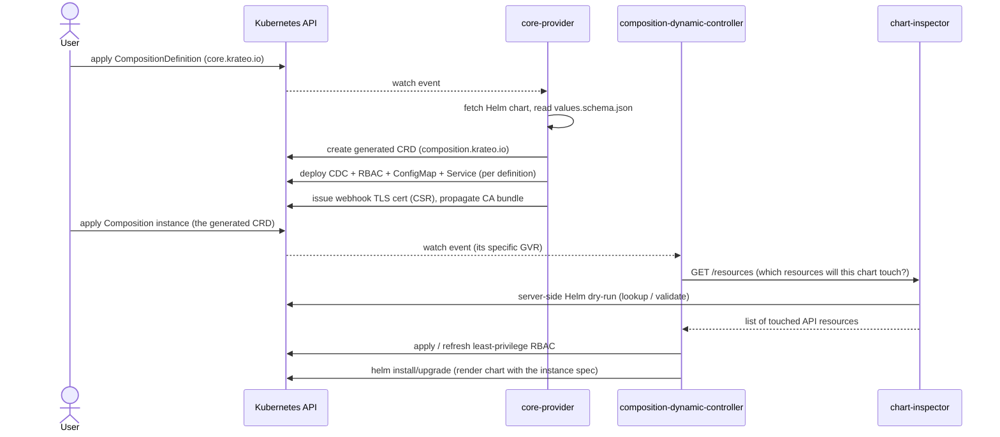
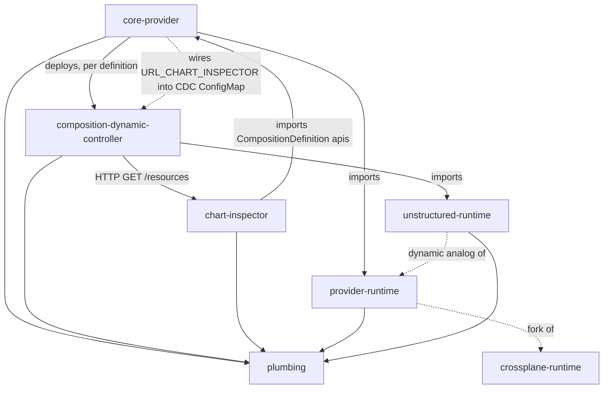

# Krateo Composable Operations — Developer Ecosystem Overview

> **Canonical cross-repo overview.** This document lives in the `core-provider` repo but describes the whole Krateo Composable Operations (KCO) stack. Every per-repo developer guide links back here.

This is a guide for **developers who work on the KCO codebases** — contributing, extending, or debugging them. It is *not* user documentation; for how to *use* Krateo, see [docs.krateo.io](https://docs.krateo.io).

---

## What KCO does, in one paragraph

KCO turns **Helm charts into Kubernetes-native APIs**. A user applies a `CompositionDefinition` (a CR in API group `core.krateo.io`) that points at a Helm chart. **core-provider** fetches the chart, generates a CRD from the chart's `values.schema.json` (in API group `composition.krateo.io`), and — per definition — deploys a **composition-dynamic-controller (CDC)** Deployment plus least-privilege RBAC, a ConfigMap, and a Service; it also manages the TLS certificates and the admission/conversion webhooks the generated CRDs rely on. A user then creates an instance of that generated CRD (a **Composition**). The **CDC** watches that one GVR, renders the chart using the instance's `spec` as Helm values, and applies the result as a Helm release — keeping it reconciled. To scope its own RBAC tightly, the CDC calls **chart-inspector** (`GET /resources`), a stateless HTTP service that runs a server-side Helm dry-run and reports the exact set of API resources the chart touches.

---

## The pipeline

Two API groups are in play, and confusing them is the most common orientation mistake:

| Group | Owned by | What it holds |
| --- | --- | --- |
| `core.krateo.io` | core-provider (static CRD, shipped in `crds/`) | `CompositionDefinition` — *the chart, as an API definition* |
| `composition.krateo.io` | core-provider (generated at runtime, one CRD per definition) | `Composition` instances — *the chart, as a usable resource* |

---

## The repositories

| Repo | Role | Built on | Kind |
| --- | --- | --- | --- |
| **core-provider** | Watches `CompositionDefinition`s; generates CRDs; deploys CDCs; manages webhooks/certs | provider-runtime | Operator (controller-runtime manager) |
| **composition-dynamic-controller** (CDC) | One controller per definition; renders & applies the chart for each `Composition` instance | unstructured-runtime | Operator (dynamic, per-GVR) |
| **chart-inspector** | Server-side Helm dry-run → list of resources a chart touches (used for RBAC scoping) | plumbing (`helm`) | Stateless HTTP service |
| **provider-runtime** | Managed-resource controller framework for **typed** providers | — (fork of crossplane-runtime) | Library |
| **unstructured-runtime** | The **dynamic/unstructured** analog of provider-runtime | — | Library |
| **plumbing** | Shared utilities: Helm engine, CRD generation, kube/event helpers, logging, env, certs, … | — | Library |

### How they depend on each other

Three facts worth internalizing because the code does *not* read the way you might assume:

1. **core-provider never calls chart-inspector.** It only injects the inspector's URL (`URL_CHART_INSPECTOR`) into the CDC's ConfigMap. The runtime HTTP client of chart-inspector is the **CDC**.
2. **chart-inspector imports core-provider's API types** (to decode the `CompositionDefinition` it fetches), so the dependency arrow points "backwards" from a deployment standpoint.
3. **core-provider does not import the CDC's or unstructured-runtime's Go code.** It *deploys* the CDC as a container image and passes it flags; the coupling is operational, not compile-time.

---

## The two runtimes, and why they look alike

`provider-runtime` and `unstructured-runtime` are intentionally **functionally equivalent**: both implement the same managed-resource lifecycle — the observe → create / update / delete loop, with finalizers, the create-safety steps, and `Ready`/`Synced` conditions. The difference is *what they operate on*:

- **provider-runtime** — **typed** custom resources registered in a scheme. Used when the provider knows its resource's type at compile time (core-provider, git-provider, github-provider, …).
- **unstructured-runtime** — **untyped** objects at a resource type chosen at runtime. Used when the type isn't known until launch (the CDC, which serves whatever resource type core-provider hands it).

Summary mapping (full version in each runtime's `04-equivalence.md`):

| Concept | provider-runtime (typed) | unstructured-runtime (dynamic) |
| --- | --- | --- |
| What you manage | a typed custom resource, registered in a scheme | untyped objects at a resource type chosen at runtime |
| Operations you implement | Observe / Create / Update / Delete | the same four operations |
| Per-resource setup | a **Connect** step builds a client per resource | **none** — one client for the whole controller |
| What Observe reports | exists, up-to-date, plus defaults-filled-in and a drift description | exists, up-to-date (minimal) |
| How it's wired | a reconciler into a controller-runtime manager | a controller on lower-level primitives — no manager |
| Work queue | the manager's rate-limited queue | a local priority queue (dedup, priority-aware) |
| Concurrency | a max-concurrent-reconciles setting | a fixed number of workers — **no autoscaling** |
| Finalizer | a configurable finalizer | a fixed finalizer name |
| Conditions | standard conditions on the typed status | the same conditions on the untyped object's status |
| Standard conditions | `Ready` / `Synced`, with the same reasons | the same |
| Pause / policies | paused + management/deletion policy annotations | the same annotation contract |
| Type resolution | scheme / RESTMapper (compile-time) | runtime pluralization |

> **If you change one runtime's lifecycle semantics, change the other to match.** The two are meant to behave identically from a resource-lifecycle standpoint; divergence is a bug, not a feature.

---

## Cross-cutting conventions

These hold across all the Go services and are worth knowing before you touch any of them.

- **Structured JSON logging.** Every service emits single-line JSON logs for the Krateo logs-ingester: canonical `timestamp` (RFC3339Nano, UTC), plus `level`, `msg`, and a constant `service` field. See each repo's `docs/log*-ingester-compatibility.md` for the exact contract — don't reinvent it.
- **OpenTelemetry metrics.** Enabled via `OTEL_ENABLED` / `OTEL_EXPORT_INTERVAL` / `OTEL_EXPORTER_OTLP_ENDPOINT`. core-provider and the CDC ship Grafana dashboards and a collector config under `telemetry/`. Reconcile/queue metrics come from the runtimes; service-specific metrics are added locally.
- **Builds.** Multi-stage `Dockerfile` (static `CGO_ENABLED=0` binary) **and** a `ko` config (`.ko.yaml`) for fast local images. `scripts/build.sh` typically does `ko build` into a KinD cluster.
- **Local dev loop.** KinD + Helm. Look for `scripts/kind-up.sh`, `scripts/devtest.sh` / `scripts/run.sh`, and `krateo-overrides.dev.yaml` (overrides image refs to local builds).
- **Shared utilities live in `plumbing`.** The Helm engine (`helm`, `helm/getter`), CRD generation (`crdgen`), event recorders (`kubeutil/event`), pluralization (`kubeutil/plurals`), env parsing (`env`), pointers (`ptr`), and certs (`certs`) are all there. Prefer reusing plumbing over re-implementing.
- **Deployment is owned by Helm charts**, not the binaries. Notably, core-provider's runtime asset templates (the CDC bundle templates) and chart-inspector's Deployment/Service are provided by `core-provider-chart`, not embedded in the images.

---

## End-to-end example (what you'll see on a cluster)

1. `kubectl apply` a `CompositionDefinition` pointing at chart `fireworks-app@1.0.0`.
2. core-provider creates CRD `fireworksapps.composition.krateo.io` and, in the definition's namespace, a `Deployment` running `composition-dynamic-controller` with args `-group=composition.krateo.io -version=v1-0-0 -resource=fireworksapps -namespace=…`, plus a `ServiceAccount`, `Role`/`RoleBinding`, `ClusterRole`/`ClusterRoleBinding`, a ConfigMap (carrying `URL_CHART_INSPECTOR`, the SA identity, `HOME=/tmp`), and a `Service`.
3. `kubectl apply` a `FireworksApp` instance with a `spec` matching the chart's values schema.
4. The CDC calls `chart-inspector` `GET /resources`, generates RBAC for exactly those resources, then `helm install`s the chart with your `spec` as values. The release's objects are labeled with `krateo.io/composition-*` for ownership.

---

## Glossary

- **CompositionDefinition** — CR in `core.krateo.io`; the chart registered as an API definition. Reconciled by core-provider.
- **Composition** — an instance of a *generated* CRD in `composition.krateo.io`; reconciled by a CDC into a Helm release.
- **CDC** — composition-dynamic-controller; one Deployment per CompositionDefinition, each watching one GVR.
- **chart-inspector** — stateless service that dry-runs a chart and lists the API resources it touches.
- **ExternalClient** — the `Observe/Create/Update/Delete` interface a controller author implements in both runtimes.
- **GVR / GVK** — GroupVersionResource / GroupVersionKind; the CDC is parameterized by a GVR at launch.
- **Managed resource** — a CR whose lifecycle a runtime reconciles via an `ExternalClient`.

---

## Where to go next

Each repo has a `docs/developer-guide/` set (start at its `README.md`):

- `core-provider/docs/developer-guide/` — the operator that drives everything
- `composition-dynamic-controller/docs/developer-guide/` — the per-composition execution engine
- `chart-inspector/docs/developer-guide/` — the dry-run / RBAC-scoping service
- `provider-runtime/docs/developer-guide/` — the typed controller framework
- `unstructured-runtime/docs/developer-guide/` — the dynamic controller framework
