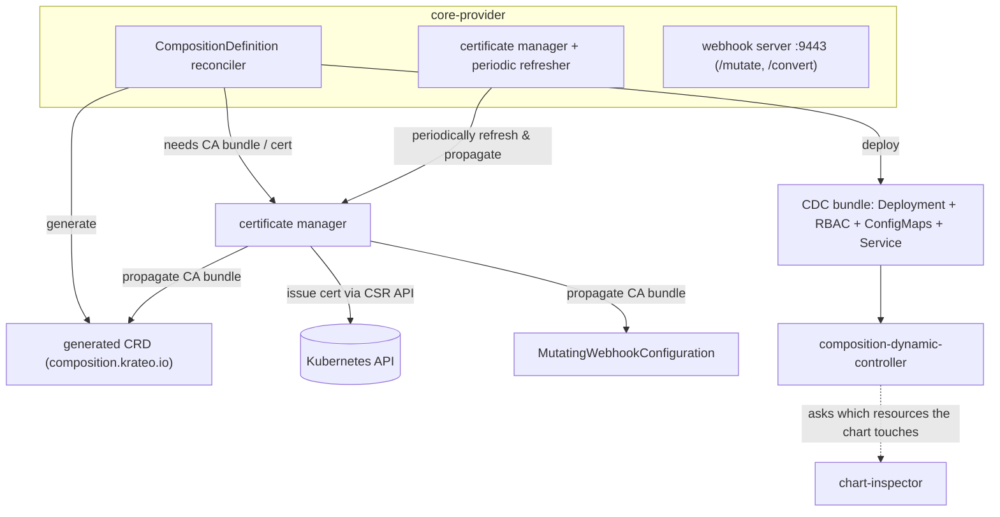
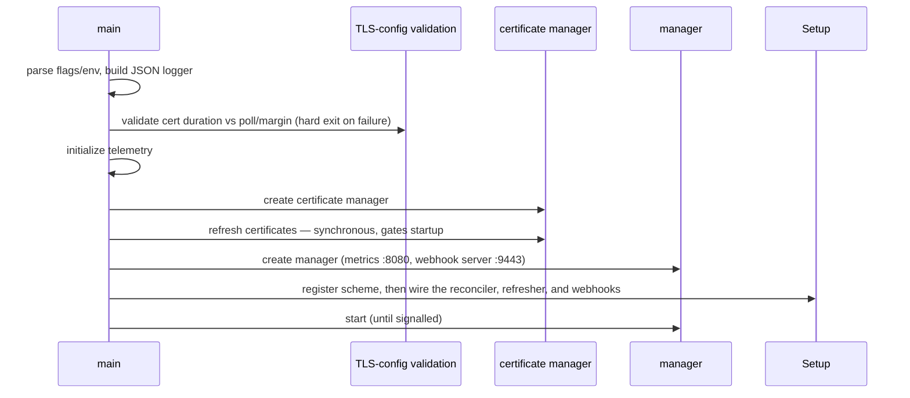

# Architecture

How `core-provider` is organized, the parts that run inside it, and how it boots.

## What it is

`core-provider` is a Kubernetes operator built on **provider-runtime**. At its heart is a single controller that reconciles `CompositionDefinition` resources; around it run a couple of supporting pieces (a certificate manager and a webhook server). Everything it produces — generated CRDs, the per-composition controller, RBAC — is a side effect of reconciling those definitions.

## The main parts

Think of the operator as a small set of cooperating components:

- **The CompositionDefinition reconciler** — the core. It watches `CompositionDefinition`s and drives the standard provider-runtime contract (`Observe` → `Create` / `Update` / `Delete`). It owns the end-to-end flow: resolve the chart, generate the CRD, deploy the CDC bundle.
- **The chart tooling** — fetches and parses Helm charts (from a Helm repo, an OCI registry, or a `.tgz`) and extracts the values schema and the target kind.
- **The CRD generator** — turns a chart's values schema into a versioned CRD and keeps it up to date, injecting the conversion-webhook configuration.
- **The deploy step** — renders and applies the "CDC bundle": the per-composition controller Deployment, its RBAC, its ConfigMaps, and its Service. See [`02-reconcile-lifecycle.md`](./02-reconcile-lifecycle.md).
- **The certificate manager + a background refresher** — issues and rotates the TLS certificate the webhook server uses, and propagates the CA bundle to the resources that need it. See [`03-crd-webhook-cert-lifecycle.md`](./03-crd-webhook-cert-lifecycle.md).
- **The webhook handlers** — a mutating admission webhook (`/mutate`) and a conversion webhook (`/convert`) for the generated CRDs.

## Component view

The PlantUML sources under [`../../_diagrams/`](../../_diagrams/) (at the repository root) carry the same picture plus the reconcile state machine.

## Two API groups

This trips people up, so state it up front:

- **`core.krateo.io`** — the provider's *own* group. `CompositionDefinition` lives here. Its CRD ships statically with the project and has a single version, a status subresource, and no conversion webhook.
- **`composition.krateo.io`** — the group of every CRD **generated at runtime** from a chart. These CRDs get a conversion webhook attached, and they are the resources the mutating webhook targets.

## How it boots

`main` runs a fixed sequence. The one load-bearing detail is that **certificates are bootstrapped before the manager starts** — the webhook server cannot serve TLS until a certificate exists, so this step is synchronous and gates startup.

The order in words:

1. **Flags / env, then logging** — configuration is read first; logging is JSON-only, matching the logs-ingester contract (`docs/log-ingester-compatibility.md`).
2. **TLS-config validation** — the process refuses to start with a certificate duration that is too short relative to the poll interval and the rotation margin. This guards the rotation math described in [`03`](./03-crd-webhook-cert-lifecycle.md).
3. **Telemetry** — OTel metrics are set up (and a set of webhook instruments created).
4. **Certificate bootstrap, before the manager** — the certificate manager issues the serving certificate synchronously so TLS material exists on disk before the webhook server comes up.
5. **Manager + webhook server** — the controller-runtime manager is created with a metrics endpoint and a webhook server, plus leader election.
6. **Wiring (`Setup`)** — the scheme is registered, then three things are attached to the manager: the reconciler, the certificate refresher, and the webhook handlers.
7. **Start** — the manager runs until the process is signalled.

## The three moving parts attached at `Setup`

1. **The reconciler** — built on provider-runtime, wrapped with a rate limiter, watching `CompositionDefinition`. Its `Observe`/`Create`/`Update`/`Delete` logic is the subject of [`02`](./02-reconcile-lifecycle.md).
2. **The certificate refresher** — a background runnable (not a controller; it watches nothing). On start it propagates the CA bundle immediately, then on a fixed interval it re-issues/rotates the certificate and re-propagates as needed. This decouples certificate rotation from CompositionDefinition reconciliation.
3. **The webhook handlers** — the mutating webhook fills in schema defaults and stamps a composition-version label on create; the conversion webhook serves the generated CRDs. Their (deliberately limited) behavior is covered in [`03`](./03-crd-webhook-cert-lifecycle.md).

`Setup` also does a small backward-compatibility cleanup at startup (removing an obsolete label from existing definitions); it is best-effort and never blocks startup.
