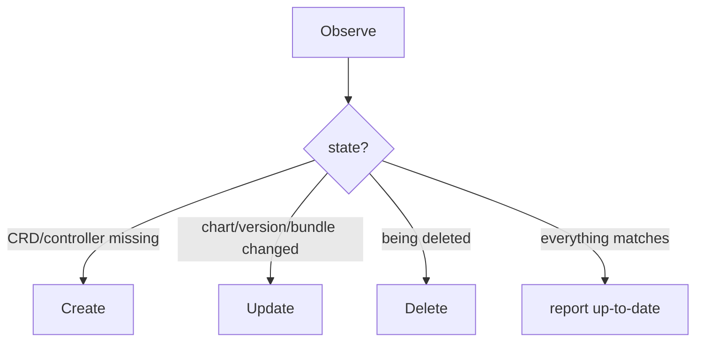
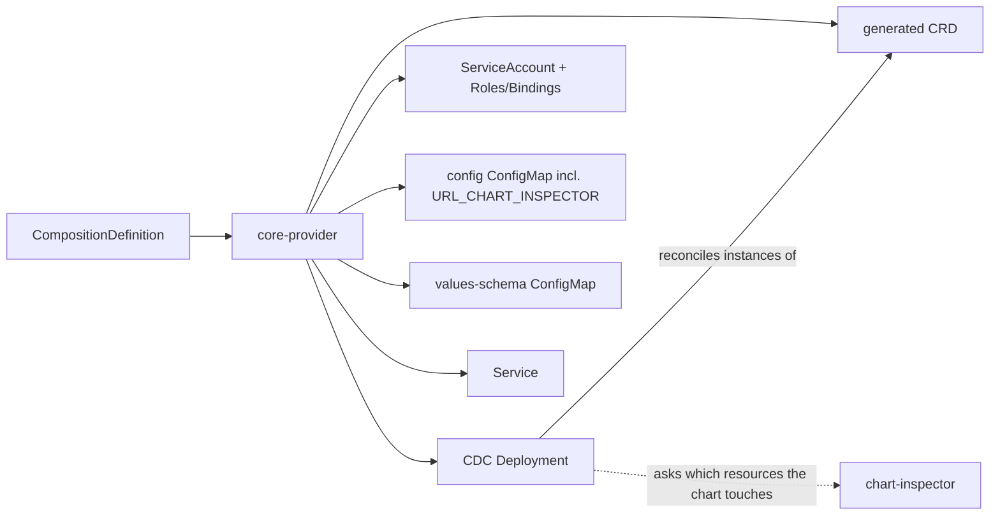

# Reconcile lifecycle

What happens each time a `CompositionDefinition` is reconciled, and what the operator deploys as a result.

## The contract

core-provider follows the provider-runtime managed-resource contract. On each reconcile the framework calls **`Observe`**; based on what `Observe` reports, it then calls **`Create`**, **`Update`**, or **`Delete`** (or nothing). The whole job of core-provider's logic is to make the cluster match the definition: the right CRD exists, the right per-composition controller is running, and the right RBAC is in place.

## The end-to-end flow

Whichever operation runs, the same building blocks are involved, in this order:

1. **Resolve the chart** from the definition's spec — download it (Helm repo, OCI, or `.tgz`), using credentials from a referenced `Secret` if provided.
2. **Read the values schema and the target kind** from the chart.
3. **Generate the CRD** for that kind in the `composition.krateo.io` group, with the chart's values schema as its spec schema.
4. **Apply the CRD** (creating or versioning it) and attach the conversion-webhook configuration with the current CA bundle.
5. **Make sure the webhook certificate is current** for this resource.
6. **Deploy the CDC bundle** — the per-composition controller and everything it needs (below).

### Observe

`Observe` is read-mostly: it resolves the chart, computes what the CRD and the bundle *should* look like, compares them against what exists, and reports two things — whether the resource "exists" (CRD present and current) and whether it is "up to date" (the rendered bundle matches what's deployed). It does a dry-run of the deploy step and compares a digest so it can detect drift without changing anything, and it also reads back what is actually deployed to catch drift introduced from outside. Finally it refreshes the definition's status (observed kind, resource, versions, package URL). Certificate management does **not** happen here — it lives in the background refresher and in Create/Update.

### Create

`Create` runs when the CRD/controller aren't there yet: generate and apply the CRD (with the CA bundle), make sure the certificate is managed for the resource, then deploy the bundle for real and record a digest of what was deployed.

### Update

`Update` re-applies the CRD and the bundle. If the chart's **version** changed — with the kind and group staying the same — it also tears down the bundle for the *old* version and relabels existing `Composition` instances so they are picked up by the controller for the new version. (That relabel is a live-data mutation.)

### Delete

`Delete` marks the definition as deleting and tears down what it owns. If this is the only definition for that resource, it first removes the `Composition` instances and waits for them to be gone, then removes the bundle. It is careful **not** to delete the CRD if other versions of it are still in use.

### Drift

The observable behavior — core-provider self-heals out-of-band changes to what it owns — is covered user-side in [Reconciliation & Lifecycle](https://docs.krateo.io). The mechanism: `Observe` reads the live bundle objects back and compares their combined digest against the one recorded at deploy time; a mismatch reports "not up to date" and the next `Update` re-applies. Detection is **digest-based over the whole bundle**, not field-by-field, so adding a new object to the bundle without also handling it on read-back makes the digest inconsistent (see [`04-extending.md`](./04-extending.md)). For the generated **CRD**, "current" compares the *status* schema, not the whole CRD (see [`03`](./03-crd-webhook-cert-lifecycle.md)).

### Adoption of an existing CRD

The behavior — applying a definition whose CRD already exists adopts it instead of failing — is covered user-side in [Reconciliation & Lifecycle](https://docs.krateo.io). Mechanically: the CRD apply path **appends** the new version to the existing CRD rather than overwriting it, so several definitions for the same kind coexist as multiple served versions sharing the `vacuum` storage version (see [`03`](./03-crd-webhook-cert-lifecycle.md)); `Delete` mirrors this, removing the CRD only when no other version still needs it.

## Disabling specific operations (management & deletion policies)

The reconciler is built on provider-runtime, which honors the `krateo.io/management-policy` and `krateo.io/deletion-policy` annotations on the `CompositionDefinition`. Here the "external resource" provider-runtime manages **is the generated CRD plus the CDC bundle**, so the policy gates whether core-provider may create/update/delete *those*. Mechanically they map onto provider-runtime's `ShouldCreate` / `ShouldUpdate` / `ShouldDelete` checks (provider-runtime's guide is the canonical description); the same annotations exist on `Composition` instances and are honored by the CDC.

The values, their effects, and YAML examples are user-facing — see [Lifecycle Policies](https://docs.krateo.io) and [Reconciliation & Lifecycle](https://docs.krateo.io) on docs.krateo.io.

## The CDC bundle

The most useful mental model of core-provider is: **for each `CompositionDefinition`, it deploys one self-contained "bundle" that runs and empowers a composition-dynamic-controller.** The bundle contains:

- **A Deployment** running the `composition-dynamic-controller` image, told (via arguments) exactly which resource to watch: the group, version, resource, and namespace of the generated CRD.
- **Least-privilege RBAC** for that controller — a ServiceAccount, a ClusterRole + binding, and a namespaced Role + binding (plus extra rules scoped to the chart's credential `Secret` when credentials are used). This is the *bootstrap* RBAC; the controller later widens its own permissions per chart using chart-inspector.
- **A config ConfigMap** carrying the controller's environment — notably the chart-inspector URL (`URL_CHART_INSPECTOR`), the ServiceAccount identity it should bind RBAC to, and a writable `HOME` for Helm's cache.
- **A values-schema ConfigMap** holding the chart's values schema.
- **A Service** for the controller.

Everything in the bundle is hashed into a single digest, and that digest is the unit of drift detection `Observe` uses. If you add a new object to the bundle, make sure it's also handled on teardown and on read-back, or drift detection will be inconsistent.

### How it connects to the CDC and chart-inspector

The bundle is everything one CDC needs to run: an identity, exactly the RBAC it should have, the chart schema, its configuration, and a Service. The Deployment's arguments tell the CDC which single resource to watch. The CDC then reads the inspector URL from its ConfigMap and asks chart-inspector which API resources the chart touches, so it can scope **its own** per-release RBAC. core-provider only provisions the CDC's base RBAC, and it never calls chart-inspector directly.

> The bundle's shape lives in **template files** that ship with the deployment, not in the binary: the Helm chart mounts them into the operator's pod at runtime. If they are missing, `Create`/`Update` fail — so when running the operator outside the chart, make sure those templates are present where it expects them.
