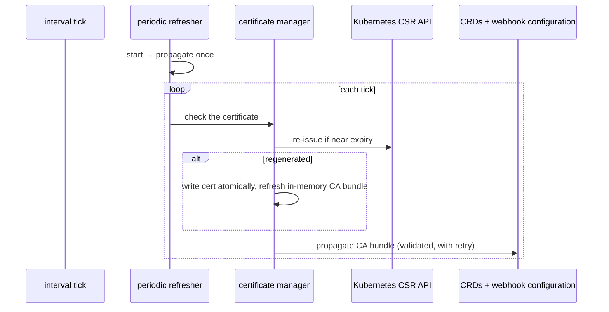

# CRDs, webhooks & certificates

How generated CRDs are produced, and how the webhook and certificate machinery keeps them working. This is the subtlest part of the system — understand the ideas before changing anything here.

## Generating a CRD from a chart

A generated CRD's **spec schema is the chart's values schema**; its **status schema is a fixed, standard schema** the operator supplies (it is not derived from the chart). The kind, group, and version come from the chart: the group is always `composition.krateo.io`, the version is derived from the chart version, and the kind from the chart name.

When a chart's version changes, the operator **adds a new version to the existing CRD** rather than replacing it. To let several versions coexist:

- each real version is marked *served*, and
- a single hidden *storage* version (named `vacuum` in the code) with a permissive schema holds storage.

When deciding whether an existing CRD needs updating, the operator compares the **status** part of the schema. The generated spec can differ harmlessly between regenerations, so comparing the whole thing would cause needless churn.

As soon as a CRD has more than one version, it needs a **conversion webhook**, which the operator configures to point at its own webhook service and stamps with the current CA bundle.

## The certificate subsystem

Webhook TLS is handled in-house using the Kubernetes **CertificateSigningRequest (CSR) API** — there is no cert-manager dependency. The operator requests a serving certificate for its webhook service's DNS name, approves the request, waits for issuance, and writes the certificate and key to a known directory that the webhook server reads from.

Two pieces collaborate:

- **The certificate manager** — the engine that issues/rotates the certificate and propagates the CA bundle.
- **The periodic refresher** — a background runnable that, on an interval, asks the manager to check the certificate and re-propagate as needed. It also propagates once eagerly at startup, to avoid a window where admission could hit missing CA data.

A few ideas worth holding onto:

- **Rotation is margin-based.** The certificate is renewed when it is within a configured margin of its lease, not when it hard-expires. This is driven by how long ago the request was issued versus the margin — so the duration and the margin must be tuned together.
- **Writes are atomic.** The certificate is written to temporary files and then renamed into place, so the webhook server never reads a half-written file.
- **Generation is serialized** and the in-memory CA bundle is guarded, so concurrent reconciles don't race.
- **Propagation is defensive.** The CA bundle's PEM structure is validated before writing (a corrupt bundle is rejected rather than overwriting good config), transient API errors are retried, and permanent ones fail fast.

## The webhooks

- **Mutation (`/mutate`)** — for `composition.krateo.io` resources, it fills in default values from the CRD's schema and, on create, stamps the `krateo.io/composition-version` label that couples a `Composition` to the CDC version that owns it (the same label the operator rewrites during a version bump).
- **Conversion (`/convert`)** — serves CRD conversion requests, but **it does not transform schemas**: it copies metadata, spec, and status verbatim into the requested version. The consequence is important — **multiple versions of a generated CRD must be field-compatible**; there is no renaming or restructuring across versions. If a chart's schema changes incompatibly between versions, this conversion model will not bridge it.

## Safety, at a glance

| Concern | How it's handled |
| --- | --- |
| Concurrent certificate generation | serialized behind a lock |
| Races on the in-memory CA bundle | guarded for concurrent reads |
| A half-written certificate file | written to a temp file, then atomically renamed |
| A corrupt CA bundle | validated before it can overwrite good config |
| Transient API errors during propagation | retried with backoff; permanent errors fail fast |
| The gap between rotations | eager propagation at startup + periodic resync |
