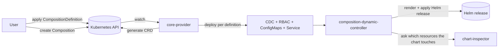

# core-provider — Developer Guide

A contributor-facing guide to the foundational operator of Krateo Composable Operations (KCO): what it does, how it reconciles, how it generates CRDs and manages webhook certificates, and where to extend it.

> Audience: engineers who **contribute to, extend, or debug `core-provider`** — not end users. For product concepts and how to *use* Krateo, see [docs.krateo.io](https://docs.krateo.io/key-concepts/kco/core-provider/overview).
>
> This guide explains *ideas and flows*, not line-by-line code. When you need exact code, the source is the source of truth.

## Role in KCO

KCO turns Helm charts into Kubernetes-native APIs. A user applies a `CompositionDefinition` (a CR in the API group `core.krateo.io`) pointing at a Helm chart. **core-provider** — built on **provider-runtime** — fetches the chart, generates a CRD from the chart's values schema (in the group `composition.krateo.io`), and per definition deploys a **composition-dynamic-controller (CDC)** plus least-privilege RBAC, two ConfigMaps, and a Service; it also manages the webhook TLS certificates and CA bundle that the generated CRDs rely on. A user then creates an instance of the generated CRD (a **Composition**). The **CDC** (built on **unstructured-runtime**) watches that resource, renders the chart with the instance's spec as Helm values, and applies it as a Helm release. To scope its own RBAC, the CDC calls **chart-inspector**, which dry-runs the chart and returns the resources it touches.

`core-provider` does **not** call chart-inspector itself; it only wires the inspector's URL into the CDC's configuration. The CDC is the runtime caller.

## Documents in this folder

| Document | What it covers |
| --- | --- |
| [`00-ecosystem-overview.md`](./00-ecosystem-overview.md) | **Canonical cross-repo overview** of the whole KCO stack. Start here for the big picture. |
| [`01-architecture.md`](./01-architecture.md) | The main parts, how they fit together, and how the operator boots. |
| [`02-reconcile-lifecycle.md`](./02-reconcile-lifecycle.md) | What happens on each reconcile, and the anatomy of the CDC "bundle" deployed per composition. |
| [`03-crd-webhook-cert-lifecycle.md`](./03-crd-webhook-cert-lifecycle.md) | How CRDs are generated and how the webhook + certificate machinery keeps them working. |
| [`04-extending.md`](./04-extending.md) | Where to make common changes. |

## See also

- **Logging** — core-provider emits structured JSON logs for the Krateo logs-ingester; the contract is documented in `docs/log-ingester-compatibility.md`.
- **Telemetry / metrics** — OTel setup and the metric catalog live under `telemetry/`.
- **Sibling repos** — **provider-runtime**, **composition-dynamic-controller**, **unstructured-runtime**, and **chart-inspector** each have their own developer guides; the [ecosystem overview](./00-ecosystem-overview.md) links them.
- **Architecture diagrams (source)** — the PlantUML diagrams under [`../../_diagrams/`](../../_diagrams/) (at the repository root) show the components and the reconcile state machine.
